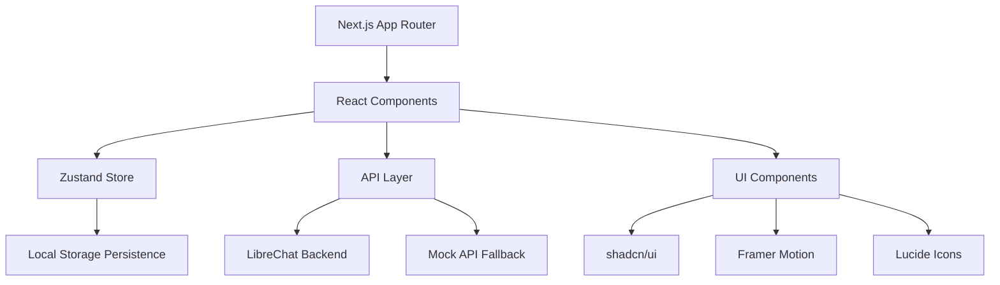

# Pixis AI Chat - Perplexity-style UI for LibreChat

A pixel-perfect recreation of Perplexity's chat/search UI using LibreChat as the backend. Built with Next.js 14, React 18, and Tailwind CSS.

## 🚀 Features

- **Perplexity-style UI**: Pixel-close layout with airy typography and smooth animations
- **Streaming Responses**: Real-time streaming with graceful abort functionality
- **Inline Citations**: Citation chips with hover tooltips and source cards
- **Follow-up Suggestions**: Smart suggestion chips for continued conversation
- **Conversation Management**: Create, rename, delete, and organize conversations in folders
- **Code Highlighting**: Syntax-highlighted code blocks with copy functionality
- **Dark Mode**: Complete dark mode support with system preference detection
- **Responsive Design**: Mobile-first design with bottom input bar and collapsible panels
- **Keyboard Shortcuts**: `/` to focus search, `Cmd/Ctrl+Enter` to submit, `Cmd/Ctrl+K` for command palette
- **Settings Modal**: Comprehensive settings for API configuration and UI preferences

## 🏗️ Architecture



### Core Components

- **Store**: Zustand with persistence for conversations, settings, and UI state
- **API Layer**: Configurable API client with mock fallback for development
- **UI Components**: shadcn/ui components with custom styling
- **Animations**: Framer Motion for micro-interactions and transitions

## 🛠️ Setup

### Prerequisites

- Node.js 18+ 
- npm or yarn
- LibreChat instance (optional for development)

### Installation

1. **Clone the repository**
   ```bash
   git clone <repository-url>
   cd pixis-ai-chat
   ```

2. **Install dependencies**
   ```bash
   npm install
   ```

3. **Environment Configuration**
   Create a `.env.local` file:
   ```env
   # LibreChat Configuration
   NEXT_PUBLIC_LIBRECHAT_BASE_URL=http://localhost:3080
   NEXT_PUBLIC_LIBRECHAT_API_KEY=your_api_key_here
   
   # Development Mode (uses mock API when true or no API key)
   NEXT_PUBLIC_USE_MOCK_API=true
   ```

4. **Start Development Server**
   ```bash
   npm run dev
   ```

5. **Open in Browser**
   Navigate to `http://localhost:3000`

## 🔧 API Integration

### LibreChat Endpoints

The app expects the following LibreChat API endpoints:

```typescript
// Chat streaming
POST /api/chat
{
  message: string;
  model?: string;
  conversationId?: string;
}

// Conversations
GET /api/conversations
POST /api/conversations
PATCH /api/conversations/:id
DELETE /api/conversations/:id

// Suggestions
GET /api/suggestions?prompt=string

// Sources
GET /api/sources?messageId=string

// Health check
GET /api/health
```

### Mock API

When `NEXT_PUBLIC_USE_MOCK_API=true` or no API key is provided, the app uses a mock API that:

- Simulates streaming responses with realistic typing speed
- Provides sample citations and follow-up suggestions
- Returns mock conversation data
- Always returns successful health checks

### Streaming Response Format

The API expects Server-Sent Events (SSE) with the following format:

```
data: {"type": "content", "content": "chunk of text"}
data: {"type": "citations", "citations": [...]}
data: {"type": "suggestions", "suggestions": [...]}
data: {"conversationId": "id"}
data: [DONE]
```

## �� UI Components

### Core Components

- **Message**: Renders chat messages with citations, code blocks, and actions
- **PromptForm**: Input form with streaming controls and keyboard shortcuts
- **Sidebar**: Conversation management with folders and CRUD operations
- **ContextPanel**: Right rail showing sources and related results
- **SettingsModal**: Comprehensive settings interface

### Styling

- **Tailwind CSS**: Utility-first styling with custom design tokens
- **shadcn/ui**: Accessible component library
- **Framer Motion**: Smooth animations and micro-interactions
- **Dark Mode**: Complete theme support via next-themes

## 📱 Responsive Design

### Breakpoints

- **Mobile** (< 768px): Bottom input bar, hidden sidebars
- **Tablet** (768px - 1024px): Sidebar visible, right rail hidden
- **Desktop** (1024px+): Full three-panel layout

### Mobile Features

- Fixed bottom input bar
- Swipe gestures for navigation
- Collapsible panels
- Touch-optimized interactions

## ⌨️ Keyboard Shortcuts

- `/` - Focus search input
- `Cmd/Ctrl + Enter` - Submit message
- `Cmd/Ctrl + K` - Open command palette (planned)
- `Escape` - Cancel streaming or close modals

## Testing
### E2E Tests (Planned)

```bash
npm run test:e2e
```

Tests will cover:
- Message submission and streaming
- Citation interaction
- Conversation management
- Settings configuration
- Responsive behavior

### Unit Tests (Planned)

```bash
npm run test
```

Tests will cover:
- Store actions and state management
- API client functionality
- Utility functions
- Component rendering

## 🚀 Deployment

### Vercel

1. **Connect Repository**
   - Link your GitHub repository to Vercel
   - Configure environment variables

2. **Environment Variables**
   ```env
   NEXT_PUBLIC_LIBRECHAT_BASE_URL=https://your-libreachat-instance.com
   NEXT_PUBLIC_LIBRECHAT_API_KEY=your_production_api_key
   NEXT_PUBLIC_USE_MOCK_API=false
   ```

3. **Deploy**
   - Vercel will automatically deploy on push to main branch
   - Preview deployments for pull requests